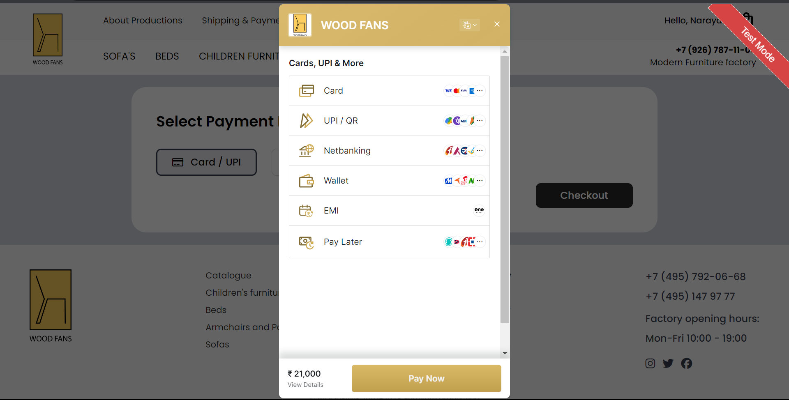

# React + Vite

This template provides a minimal setup to get React working in Vite with HMR and some ESLint rules.

Currently, two official plugins are available:

- [@vitejs/plugin-react](https://github.com/vitejs/vite-plugin-react/blob/main/packages/plugin-react/README.md) uses [Babel](https://babeljs.io/) for Fast Refresh
- [@vitejs/plugin-react-swc](https://github.com/vitejs/vite-plugin-react-swc) uses [SWC](https://swc.rs/) for Fast Refresh
# Wood Fans - Where Comfort Meets Craftsmanship

## Table of Contents

1. [About Wood Fans](#about-wood-fans)
2. [Live Demo](#live-demo)
3. [Features](#features)
4. [Tech Stack](#tech-stack)
5. [Screenshots](#screenshots)
6. [Contributors](#contributors)

## About Wood Fans

Welcome to **Wood Fans**, a haven where craftsmanship and comfort converge to redefine your living spaces. At Wood Fans, we take pride in offering a curated selection of sustainable furniture solutions, transforming your home into a sanctuary of style and relaxation.

### Specializations

Discover our expertise in two primary categories:

1. **Sofa Furniture:** Immerse yourself in the luxurious comfort of our thoughtfully crafted sofa collection, combining aesthetics with functionality for a cozy living experience.

2. **Children's Furniture:** Explore a delightful array of furniture tailored specifically for children, where safety meets creativity, making their spaces as special as they are.

## Live Demo

- [🚀 Explore Wood Fans](https://wood-fans-team.vercel.app/)

## Features

- **Product Catalog:** Explore a diverse catalog of carefully curated furniture pieces.
- **Responsive Design:** Enjoy a seamless experience across various devices and screen sizes.
- **Detailed Product Descriptions:** Make informed choices with comprehensive product information.
- **Efficient Product Search:** Easily find the perfect furniture pieces with our efficient search functionality.
- **Shopping Cart:** Conveniently manage your selections before making a purchase.
- **Order Price Calculation:** Get transparent and accurate price calculations for your orders.
- **Secure Checkout:** Rest easy with our secure and reliable checkout process.

## Tech Stack

- **Frontend:** React, Redux, CSS
- **Fetching:** Axios
- **Routing:** React-router-dom
- **Authentication:** Firebase
- **Database:** Firebase Realtime Database
- **Payment:** RazorPay
- **Deployment:** Vercel

## Screenshots

Check out these snapshots showcasing Wood Fans on different devices.

- 
- 
- 
- 
- 
- 
- 

## Contributors

Meet the talented individuals behind Wood Fans:

- **Narayan Das 🌟:** [Github](https://github.com/noobnarayan)
- **Raghav Bhati 🚀:** [Github](https://github.com/Raghavbhati)
- **Md. Salman 🎯:** [Github](https://github.com/Mohd-Salman-0119)
- **Swati Mandal 💻:** [Github](https://github.com/swatii23)
