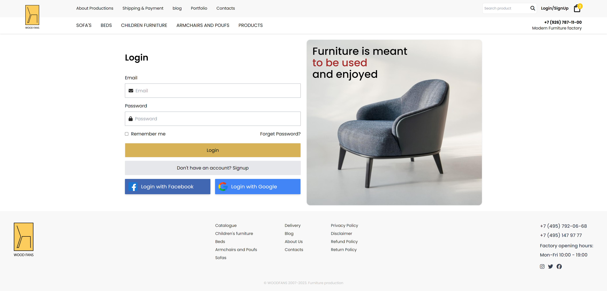
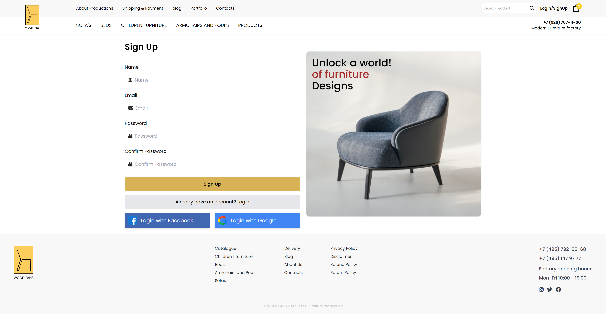
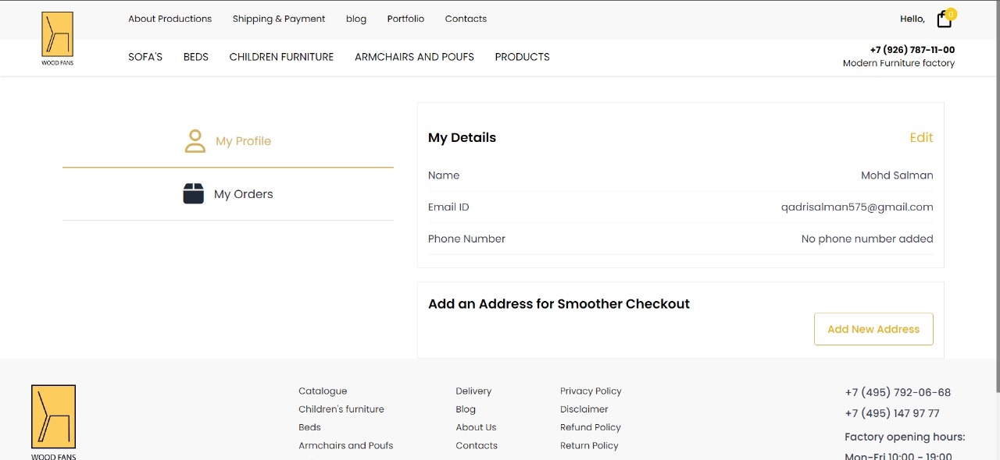
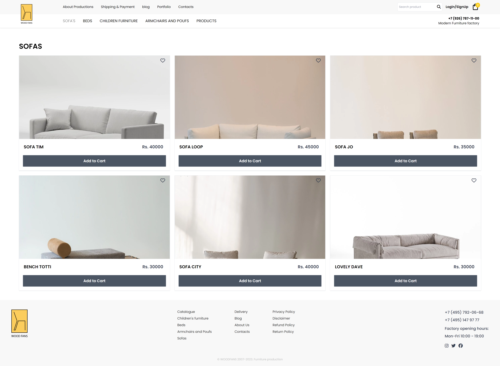
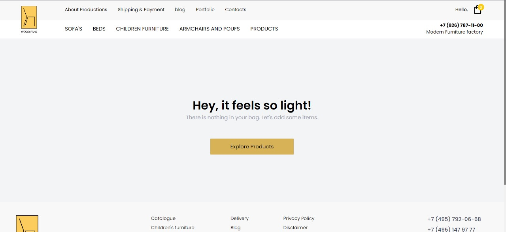
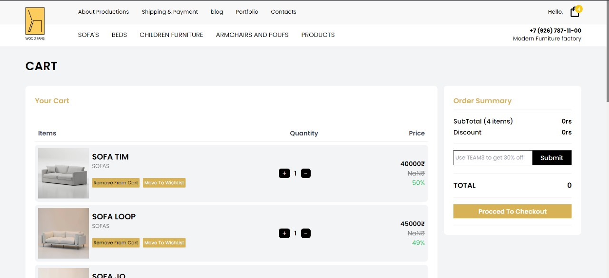
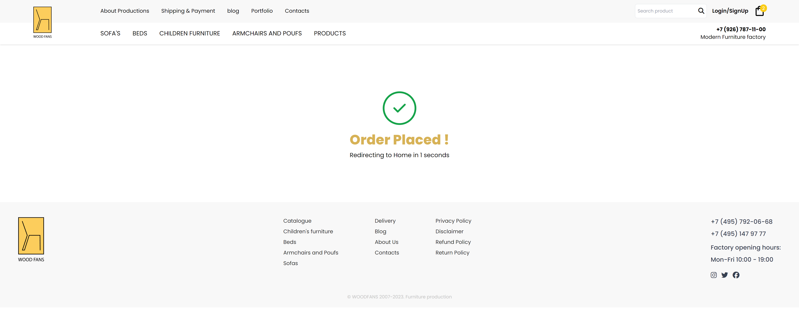

# Wood Fans - Where Comfort Meets Craftsmanship

## Table of Contents

1. [About Wood Fans](#about-wood-fans)
2. [Live Demo](#live-demo)
3. [Features](#features)
4. [Tech Stack](#tech-stack)
5. [Screenshots](#screenshots)
6. [Contributors](#contributors)

## About Wood Fans

Welcome to **Wood Fans**, a haven where craftsmanship and comfort converge to redefine your living spaces. At Wood Fans, we take pride in offering a curated selection of sustainable furniture solutions, transforming your home into a sanctuary of style and relaxation.

### Specializations

Discover our expertise in four primary categories:

1. **Sofa Furniture:** Immerse yourself in the luxurious comfort of our thoughtfully crafted sofa collection. Each piece combines aesthetics with functionality for a cozy living experience.

2. **Bedroom Furniture:** Elevate your sleep sanctuary with our collection of meticulously designed beds. Experience a perfect blend of comfort and style for a restful night's sleep.

3. **Children's Furniture:** Explore a delightful array of furniture tailored specifically for children. Our safe and creative designs make their spaces as special as they are.

4. **Armchairs:** Unwind in style with our elegant armchairs. Crafted for both comfort and aesthetics, these pieces add a touch of sophistication to any room.

## Live Demo

- [🚀 Explore Wood Fans](https://wood-fans-team.vercel.app/)

## Features

- **Product Catalog:** Explore a diverse catalog of carefully curated furniture pieces.
- **Responsive Design:** Enjoy a seamless experience across various devices and screen sizes.
- **Detailed Product Descriptions:** Make informed choices with comprehensive product information.
- **Efficient Product Search:** Easily find the perfect furniture pieces with our efficient search functionality.
- **Shopping Cart:** Conveniently manage your selections before making a purchase.
- **Order Price Calculation:** Get transparent and accurate price calculations for your orders.
- **Secure Checkout:** Rest easy with our secure and reliable checkout process.

## Tech Stack

- **Frontend:** React, Redux, CSS
- **Fetching:** Axios
- **Routing:** React-router-dom
- **Authentication:** Firebase
- **Database:** Firebase Realtime Database
- **Payment:** RazorPay
- **Deployment:** Vercel

## Screenshots

Check out these snapshots showcasing Wood Fans on different devices.

- Home Page

    

- Login Page

    

- Signup Page

    

- User Profile Page

    

- Product Page

    

- Product Detail Page

    

- Cart Page

    
    

- Delivery Detail Page

    

- Payment Page

    

- Order Successful Page

    

## Contributors

Meet the talented individuals behind Wood Fans:

- **Narayan Das 🌟:** [Github](https://github.com/noobnarayan)
- **Raghav Bhati 🚀:** [Github](https://github.com/Raghavbhati)
- **Md. Salman 🎯:** [Github](https://github.com/Mohd-Salman-0119)
- **Swati Mandal 💻:** [Github](https://github.com/swatii23)
